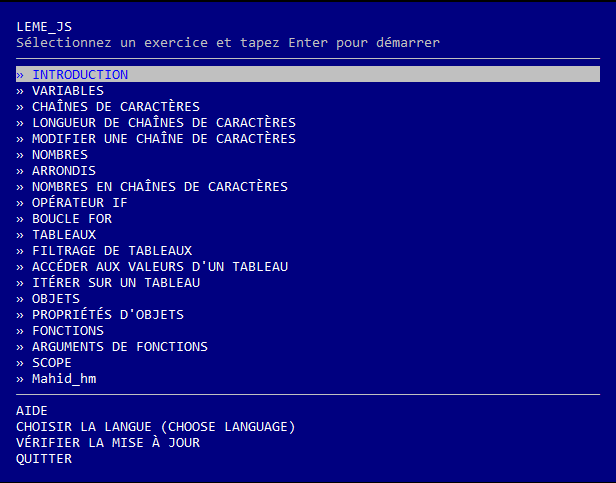

# LeMe_JS

> Apprenez JavaScript en vous aventurant dans le terminal. 

## Obtenir de l'aide :
Vous avez des problèmes avec LeMe_JS ? Obtenez de l'aide pour le dépannage en expliquant exactement votre problème sur le forum https://itotafrica.com/forum ou en me contactant directement via

mahid@itotafrica.com

## Installation de Node.js

Assurez-vous que Node.js est installé sur votre ordinateur.

Installez-le depuis [nodejs.org/download](http://nodejs.org/download)

Sous Windows si vous utilisez la version v4 ou v5 de Node.js ? Assurez-vous que vous utilisez au moins 5.1.0, qui fournit une solution à un bogue sur Windows dans lequel vous ne pouvez pas choisir des éléments dans le menu de LeMe_JS.

### Comment installer `LeMe_JS` 

1. Premièrement, télécharger ce repository avec Git : 
    > git clone https://github.com/Mahi2/leme_js.git

   Ou en cliquant simplement sur le bouton "Clone or download" de Github

2. Une fois le dossier télécharger sur votre machine, copiez-le et rendez-vous dans le dossier :
    > C:\Users\votre_nom_dutilisateur\AppData\Roaming\npm\node_modules\
   
   Et collez-y le dossier que vous venez de télécharger en le renomant en 'javascripting'.

3. Ensuite lancez votre terminal et saisissez :
```
javascripting
```

Vous allez voir un menu



Naviguez dans le menu avec les touches fléchées haut et bas.

Choisissez un défi en appuyant sur Entrée.

### Jetez un oeil à ce tuto qui montre comment faire tout ceci et comment relever le premier défi:

TUTO BIENTOT DISPONIBLE


Vous pouvez utiliser n'importe quel éditeur que vous aimez.

[visualStudioCode](https://code.visualstudio.com/) ou [sublime text](https://www.sublimetext.com/) ou [brackets](http://brackets.io/) sont trois bonnes options.

## Besoin d'aide pour un exercice?

Ouvrez une nouvelle conversation sur le forum https://itotafrica.com/forum

Incluez le nom `leme_js` et le nom du défi sur lequel vous travaillez dans le titre du problème.

## CE QUI RESTE A FAIRE :

Ajouter ces challenges :

- "OBJECT KEYS"
- "FUNCTION RETURN VALUES"
- "THIS"
- "SCOPE"

## License

MIT
# LeMe_js
